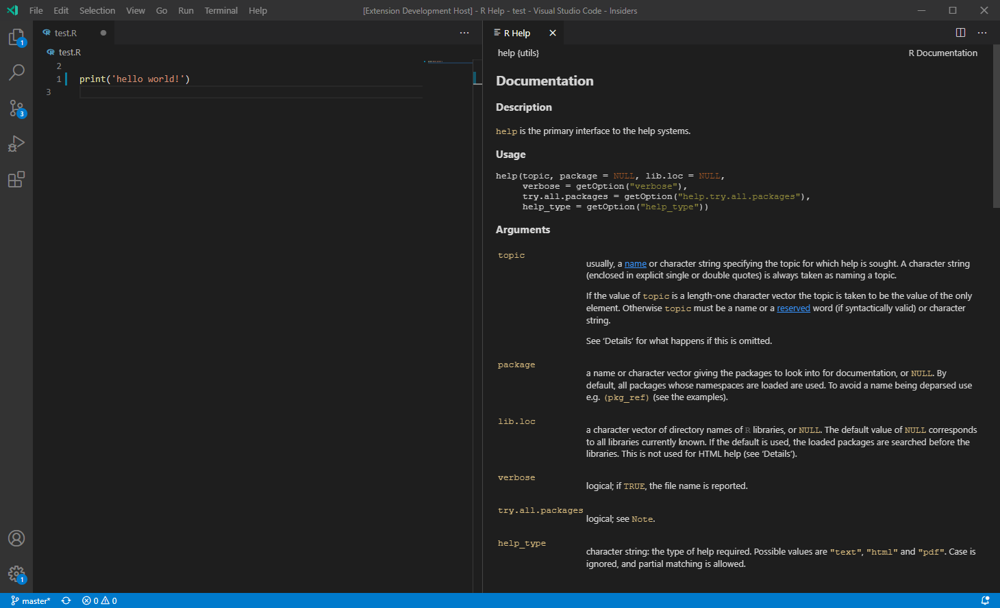

# ***NOTE:** See [PR #433](https://github.com/Ikuyadeu/vscode-R/pull/433) for an integration of this repository in vscode-R*

# vscode-R-help

VS Code extension that adds the command `rhelp.showHelp` to provide help for R functions/packages.

The help files are located in R's package libraries and their content is rendered in a vs code webview

Advantages of this approach:
* Help opens inside vscode (as opposed to the external browser usually opened by `help(...)`)
* The extension can modify the content of help pages:
    * Apply custom CSS to match the color theme of the editor
    * Apply syntax highlighting to code examples
    * Enable further customization (foldable sections, "click-to-run" examples, ...)
* The help server is independent of any running R session

## Example

## How to use

Install node packages with `npm install`, open repo root in vscode, and press F5 to launch the extension.

In the newly opened vscode window, press `F1` to open the command palette and run the command `rhelp.showHelp`.

By default, the package uses the command `R` to execute R, this default is currently hardcoded in
[helpServer.ts](./src/helpServer.ts#L37)
and might need to be modified.

## WIP

This repo is not intended to be a standalone extension but rather as a sandbox to develop the functionality.
In the long run, it might be nice to integrate parts of this e.g. in
[vscode-R](https://github.com/Ikuyadeu/vscode-R)
and/or
[vscode-R-debugger](https://github.com/ManuelHentschel/VSCode-R-Debugger).

Todos:
* Improve style of help pages
* Make syntax highlighting use theme colors from VS Code
* Develop proper interface with R/vscode-R/vscode-R-debugger
* ...

